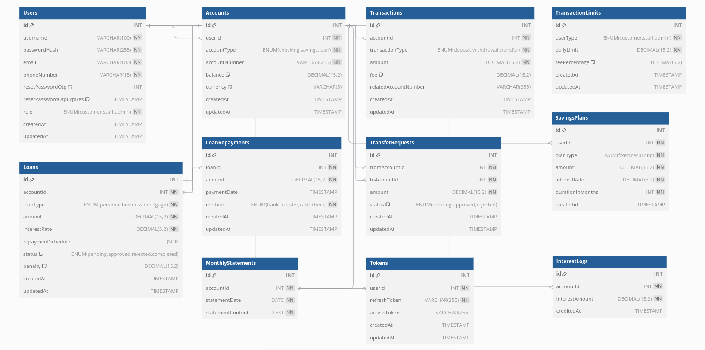

# Bank Management Application

## Overview

The Bank Management Application simulates core banking functionalities by providing a centralized system for account management, transactions, and reporting. The backend API serves as the core of the system, enabling seamless interaction for various user roles, including customers, bank staff, and admins.

## Key Features 

### **Features Overview**

1. **User Authentication and Authorization**
   - **User Registration**:  
   - New users can register with a username, password, email, and role.  
   - Validates inputs and prevents duplicate usernames.  
   - Sends a welcome email after successful registration.
   - **User Login**:  
   - Authenticates users using username and password.  
   - Issues JWT access and refresh tokens for session management.  
   - Logs invalid login attempts for security.
   - **Token Verification**:  
   - Verifies JWT access tokens for validity.  
   - Ensures refresh tokens exist in the database.
   - **Password Reset**:  
   - Forgot password feature generates OTP sent via email.  
   - Users can verify OTP to securely reset their password.
   - **Logout**:  
   - Deletes refresh tokens from the database to end the user session.
2. **Account Management**
   - **Account Types**: Supports checking, savings, and loan accounts.  
   - **CRUD Operations**: Enables account creation, viewing, updating, and deletion.  
   - **Account Details**: Displays balances, transaction history, and user details.  
   - **Multi-Currency Support**: Optionally supports different currencies for balances.
3. **Transactions and Fund Transfers**
   - **Deposits and Withdrawals**:
   - Deposit money into their accounts.
   - Withdraw money from their accounts.  
   - **Fund Transfers**:  
   - Internal transfers between accounts.  
   - External transfers (requires approval for interbank transactions).  
   - **Transaction Limits and Fees**:  
   - Allows admins to set daily transaction limits and fees for different roles.  
   - **Transaction History**:  
   - Stores and retrieves transaction records with details like amount, type, and fees.
4. **Loan Management**
   - Loan Application: Enable customers to apply for loans (with fields for loan type, amount etc.).
   - Loan Approval Workflow: Admins or managers review and approve/reject loan applications.
   - Repayment Schedules: Calculate and display loan repayment schedules, including interest.
   - Penalty Calculation: Add functionality to handle penalties for overdue repayments.

5. **Interest Calculation and Savings Plans**
   - Interest Calculation Engine: Calculate monthly or yearly interest based on account types.
   - Savings Plans: Offer fixed deposit or recurring deposit plans with interest calculations.
   - Automated Interest Credit: Monthly crediting of interest to accounts with a scheduler.

6. **Reporting and Statements**
   - Monthly Statements: Generate monthly account statements with all transactions.
   - Detailed Reports: Include reports on account summaries, loan balances, and transaction history.

## Feature Table

| **Feature**                          | **Customer**                    | **Bank Staff**                         | **Admin**                              |
|--------------------------------------|----------------------------------|----------------------------------------|----------------------------------------|
| **User Authentication**              | JWT-based Login                 | JWT-based Login                        | JWT-based Login                        |
| **Account Management**               |                                  |                                        |                                        |
| - View Account Details               | ✅                               | ✅                                     | ✅                                     |
| - Create Accounts                    | ❌                               | ✅                                     | ✅                                     |
| - Update Accounts                    | ❌                               | ✅                                     | ✅                                     |
| - Delete Accounts                    | ❌                               | ✅                                     | ✅                                     |
| - Multi-Currency Support             | ✅ (for balance display)         | ✅                                     | ✅                                     |
| **Transactions and Fund Transfers**  |                                  |                                        |                                        |
| - Deposit Money                      | ✅                               | ✅                                     | ✅                                     |
| - Withdraw Money                     | ✅                               | ✅                                     | ✅                                     |
| - Transfer Money (Internal)          | ✅                               | ✅                                     | ✅                                     |
| - Transfer Money (External)          | ✅ (via approval)                | ✅ (approve/reject requests)           | ✅ (approve/reject requests)           |
| - Transaction History                | ✅                               | ✅                                     | ✅                                     |
| - Set Transaction Limits and Fees    | ❌                               | ❌                                     | ✅                                     |
| **Loan Management**                  |                                  |                                        |                                        |
| - Apply for Loan                     | ✅                               | ❌                                     | ❌                                     |
| - Approve/Reject Loan Applications   | ❌                               | ✅                                     | ✅                                     |
| - View Loan Details                  | ✅ (own loans)                   | ✅                                     | ✅                                     |
| - Penalty Handling                   | ❌                               | ✅                                     | ✅                                     |
| **Reports and Statements**           |                                  |                                        |                                        |
| - Monthly Account Statements         | ✅ (own accounts only)           | ✅                                     | ✅                                     |
| - Generate Detailed Reports          | ❌                               | ✅                                     | ✅                                     |

## Technical Stack

- **Backend**: Node.js with Express.js
- **Database**: MySQL
- **Authentication**: JWT-based authentication
- **Reporting**: Custom reporting tools

## ERD Diagram

### Entity-Relationship Diagram (ERD)

You can view the ERD diagram at the following link:
[View ERD Diagram](https://dbdiagram.io/d/Entity-Relationship-Diagram-ERD-for-Bank-Management-Application-6788ac626b7fa355c30d056d)

## Setup Instructions

1. Clone this repository.
2. Create a `.env` file in the root directory with your database credentials and JWT secret.
3. Run `docker-compose up --build` to start the application.

## API Endpoints

- **POST /api/auth/register** - Register a new user.
- **POST /api/auth/login** - Login an existing user.

## Testing

- **Import the JSON into Postman**
  - Open Postman.
  - Click on the "Import" button in the top left.
  - Choose the "File" tab, and select [`Bank Management Application.postman_collection.json`](https://github.com/sazzadulalambd/bank-management-app/blob/main/Bank%20Management%20Application.postman_collection.json) from your local directory.
  - Once imported, you can view and interact with the collection in Postman.

## License

This project is licensed under the MIT License.
