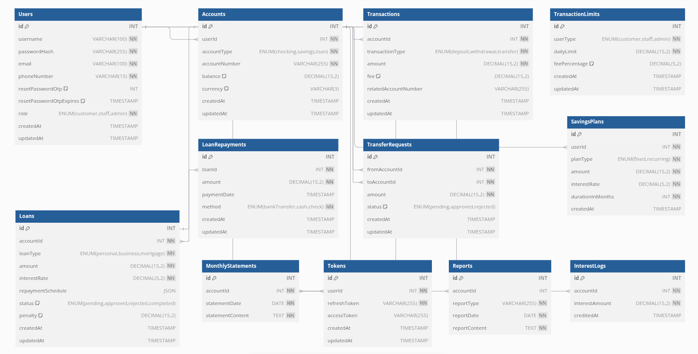

# Bank Management Application

## Overview

The Bank Management Application simulates core banking functionalities by providing a centralized system for account management, transactions, and reporting. The backend API serves as the core of the system, enabling seamless interaction for various user roles, including customers, bank staff, and admins.

## Key Features 

1. **User Authentication and Authorization**
   - **User Registration**
   - Allows new users to create an account by providing a username, password, email, and role.
   - Validates input fields and checks for existing usernames.
   - Sends a welcome email upon successful registration.
   - **User Login**
   - Authenticates users using their credentials (username and password).
   - Generates JWT access and refresh tokens for session management.
   - Logs invalid login attempts for security monitoring.
   - **Token Verification**
   - Validates JWT access tokens to ensure they are still valid.
   - Confirms the existence of refresh tokens in the database.
   - **Password Reset**
   - Implements a forgot password feature that generates a one-time password (OTP) sent to the user's email.
   - Allows users to verify the OTP and reset their passwords securely.
   - **Logout**
   - Removes the user's refresh token from the database to invalidate their session.

2. **Account Management**
   - Account Types: Support for checking, savings, and loan accounts.
   - CRUD Operations: Allow creation, viewing, updating, and deletion of accounts.
   - Account Details: Display balance, account history, and customer details.
   - Multi-Currency Support: Optionally add support for different currencies if needed.

3. **Transactions and Fund Transfers**
   - Deposit and Withdrawals: Enable deposits, withdrawals, and transfers between accounts.
   - Fund Transfers: Allow internal and external fund transfers (between different banks).
   - Transaction Limits and Fees: Set daily transaction limits and apply fees for certain types of accounts.
   - Transaction History: Store and retrieve transaction history for each account.

4. **Loan Management**
   - Loan Application: Enable customers to apply for loans (with fields for loan type, amount etc.).
   - Loan Approval Workflow: Admins or managers review and approve/reject loan applications.
   - Repayment Schedules: Calculate and display loan repayment schedules, including interest.
   - Penalty Calculation: Add functionality to handle penalties for overdue repayments.

5. **Interest Calculation and Savings Plans**
   - Interest Calculation Engine: Calculate monthly or yearly interest based on account types.
   - Savings Plans: Offer fixed deposit or recurring deposit plans with interest calculations.
   - Automated Interest Credit: Monthly crediting of interest to accounts with a scheduler.

6. **Reporting and Statements**
   - Monthly Statements: Generate monthly account statements with all transactions.
   - Detailed Reports: Include reports on account summaries, loan balances, and transaction history.

7. **Security and Compliance**
   - Encryption: Encrypt sensitive data, like account numbers and passwords.

## Technical Stack

- **Backend**: Node.js with Express.js
- **Database**: MySQL
- **Authentication**: JWT-based authentication
- **Reporting**: Custom reporting tools

## ERD Diagram

### Entity-Relationship Diagram (ERD)

You can view the ERD diagram at the following link:
[View ERD Diagram](https://dbdiagram.io/d/Entity-Relationship-Diagram-ERD-for-Bank-Management-Application-6788ac626b7fa355c30d056d)

## Setup Instructions

1. Clone this repository.
2. Create a `.env` file in the root directory with your database credentials and JWT secret.
3. Run `docker-compose up --build` to start the application.

## API Endpoints

- **POST /api/auth/register** - Register a new user.
- **POST /api/auth/login** - Login an existing user.

## Testing

Run tests using Jest or Mocha.

## License

This project is licensed under the MIT License.
